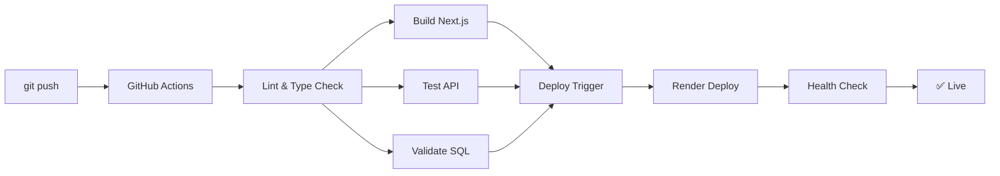

# 🚀 CI/CD Automático - JLA Importadora

Sistema de integração e deploy contínuo configurado com GitHub Actions e Render.

## 📋 Visão Geral

### Pipelines Configurados

1. **CI/CD Principal** (`.github/workflows/ci-cd.yml`)
   - Lint e validação de código
   - Build do Next.js
   - Testes da API
   - Validação de schema SQL
   - Deploy automático para Render
   - Health checks pós-deploy

2. **Verificação de Dependências** (`.github/workflows/dependency-check.yml`)
   - Executa semanalmente (segundas, 9h UTC)
   - Verifica pacotes desatualizados
   - Audit de segurança
   - Cria issues automáticas para vulnerabilidades

3. **Preview de PRs** (`.github/workflows/preview.yml`)
   - Build de preview para Pull Requests
   - Comenta nos PRs com status do build

---

## 🔧 Configuração Inicial

### 1. Deploy Hooks do Render

Obtenha os Deploy Hooks no Render Dashboard:

#### Backend (jla-importadora-api)
```
https://dashboard.render.com → jla-importadora-api
→ Settings → Deploy Hook → Copy
```

#### Frontend (jla-importadora-web)
```
https://dashboard.render.com → jla-importadora-web
→ Settings → Deploy Hook → Copy
```

### 2. GitHub Secrets

Adicione os secrets no repositório:

```
https://github.com/avilaops/jla/settings/secrets/actions
```

| Nome | Valor | Descrição |
|------|-------|-----------|
| `RENDER_DEPLOY_HOOK_API` | `https://api.render.com/deploy/srv-xxxxx?key=yyyy` | Deploy hook do backend |
| `RENDER_DEPLOY_HOOK_WEB` | `https://api.render.com/deploy/srv-zzzzz?key=wwww` | Deploy hook do frontend |

### 3. Script Auxiliar

Execute o script de configuração:

```bash
# Linux/Mac
chmod +x scripts/setup-deploy-hooks.sh
./scripts/setup-deploy-hooks.sh

# Windows (PowerShell)
bash scripts/setup-deploy-hooks.sh
```

---

## 🔄 Fluxo de Deploy Automático

### Quando você faz push para `main`:



### Etapas Detalhadas

1. **Lint & Code Quality** (1-2 min)
   - ESLint
   - TypeScript type checking
   - Code formatting validation

2. **Build Next.js** (2-3 min)
   - npm install
   - next build
   - Upload artifacts

3. **Test Backend API** (1 min)
   - Start Express server
   - Health check
   - Test endpoints (/api/produtos, /api/categorias)

4. **Validate SQL Schema** (1 min)
   - Spin up PostgreSQL container
   - Execute database-schema.sql
   - Verify tables created

5. **Deploy Notification** (30 seg)
   - Trigger Render deploy via webhook
   - Backend e Frontend em paralelo

6. **Post-Deploy Check** (3-5 min)
   - Aguarda 3 minutos
   - Health check em produção
   - Testa endpoints públicos

**Tempo total**: ~10-15 minutos

---

## 📊 Monitoramento

### GitHub Actions

Visualize builds e deploys em:
```
https://github.com/avilaops/jla/actions
```

### Render Dashboard

Monitore status dos serviços:
```
https://dashboard.render.com
```

### Logs em Tempo Real

```bash
# Via Render CLI (após instalar)
render logs -s jla-importadora-api --tail
render logs -s jla-importadora-web --tail
```

---

## 🐛 Troubleshooting

### Build falha no GitHub Actions

**Erro de lint/type check:**
```bash
# Local
npm run lint
npx tsc --noEmit

# Corrigir
npm run lint -- --fix
```

**Build do Next.js falha:**
```bash
# Limpar cache
rm -rf .next
npm run build
```

### Deploy não é triggerado

**Verificar secrets:**
1. GitHub → Settings → Secrets and variables → Actions
2. Confirme que `RENDER_DEPLOY_HOOK_API` e `RENDER_DEPLOY_HOOK_WEB` existem
3. Verifique se as URLs estão corretas (devem começar com `https://api.render.com/deploy/`)

**Verificar permissões:**
- Repository → Settings → Actions → General
- Workflow permissions: "Read and write permissions"

### Health check pós-deploy falha

**Serviço ainda iniciando:**
- Render plano free pode levar 30-60s para acordar
- Pipeline aguarda 3 minutos automaticamente

**Erro real na aplicação:**
1. Acesse Render Dashboard
2. Verifique logs do serviço
3. Confirme variáveis de ambiente
4. Teste endpoints manualmente

---

## 🔐 Segurança

### Secrets Gerenciados

- ✅ Deploy hooks armazenados como secrets
- ✅ Nunca commitados no repositório
- ✅ Acessíveis apenas por workflows autorizados

### Dependências

- ✅ Audit semanal automático
- ✅ Issues criadas para vulnerabilidades
- ✅ Cache de npm para builds mais rápidos

---

## 📝 Workflows Disponíveis

### Deploy Manual

Trigger deploy sem commit:

```bash
# Via GitHub UI
Actions → CI/CD Pipeline → Run workflow → Run workflow

# Via GitHub CLI (gh)
gh workflow run ci-cd.yml
```

### Verificação de Dependências Manual

```bash
# Via GitHub UI
Actions → Dependency Updates Check → Run workflow

# Via GitHub CLI
gh workflow run dependency-check.yml
```

---

## 🎯 Boas Práticas

### Commits

Use conventional commits para melhor rastreamento:

```bash
git commit -m "feat: Nova funcionalidade"
git commit -m "fix: Correção de bug"
git commit -m "docs: Atualização de documentação"
git commit -m "chore: Manutenção de código"
```

### Branches

```bash
# Desenvolvimento em branches
git checkout -b feature/nova-funcionalidade
git push origin feature/nova-funcionalidade

# Pull Request → Review → Merge to main → Auto Deploy
```

### Testes Locais

Antes de fazer push:

```bash
# Lint
npm run lint

# Type check
npx tsc --noEmit

# Build
npm run build

# Test API
npm run api &
curl http://localhost:3000/health
```

---

## 📈 Métricas

### Build Times (Aproximado)

| Job | Tempo Médio |
|-----|-------------|
| Lint | 1-2 min |
| Build | 2-3 min |
| Test API | 1 min |
| Validate SQL | 1 min |
| Deploy | 3-5 min |
| Health Check | 3 min |
| **Total** | **10-15 min** |

### Custos

- **GitHub Actions**: Grátis (2000 min/mês repositórios privados)
- **Render**: Grátis (plano free, 750h/mês por serviço)

---

## 🔄 Atualizações Futuras

### Melhorias Planejadas

- [ ] Testes E2E com Playwright
- [ ] Lighthouse CI para performance
- [ ] Notificações no Discord/Slack
- [ ] Deploy staging automático
- [ ] Rollback automático em caso de falha
- [ ] Cobertura de testes
- [ ] Análise de bundle size

---

## 🆘 Suporte

### Documentação

- [GitHub Actions Docs](https://docs.github.com/actions)
- [Render Deploy Hooks](https://render.com/docs/deploy-hooks)
- [Guia de Deploy](./DEPLOY-RENDER.md)

### Comandos Úteis

```bash
# Ver status do último workflow
gh run list --limit 1

# Ver logs de uma run específica
gh run view [RUN_ID] --log

# Cancelar workflow em execução
gh run cancel [RUN_ID]

# Re-run workflow que falhou
gh run rerun [RUN_ID]
```

---

**CI/CD configurado por GitHub Copilot** 🤖✨

Pipeline ativo em: https://github.com/avilaops/jla/actions
